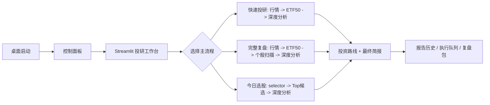

# NASDX Product Flow Audit

本轮范围：只做审计和文档，不重排页面。结论先行：功能基本都有，但普通用户从桌面启动到完成一次投研闭环时，下一步动作不够集中，CLI 能力强于 Streamlit 暴露能力。

## Findings

| Priority | Problem | Evidence | Impact | Fix plan | Verification |
|---|---|---|---|---|---|
| P1 | 桌面默认进入投资路线，但缺少“开始一次投研”的主按钮 | `启动NASDX桌面.bat:6`, `app.py:565`, `app.py:283`, `README.md:406` | 新用户看到空路线时不知道下一步 | 把 `plan` 页升级为“投研工作台”，提供快速投研、完整复盘、今日选股后深度分析、只重算路线四个主动作 | Playwright/手工打开 `?page=plan` 检查主 CTA |
| P1 | CLI 有 selector 一键闭环，Streamlit 没有同等入口 | `run_investment_workflow.py:24`, `run_investment_workflow.py:114`, `app.py:283`, `selector_page.py:185` | 今日选股到深度分析需要手动串联 | 深度页 workflow 增加 selector；selector 页增加“用 Top1 跑完整投研” | `python -B run_investment_workflow.py --workflow selector --analysis-mode rules --dry-run` plus UI smoke |
| P1 | 报告查看不是一等页面 | `app.py:244`, `app.py:488`, `app.py:1632` | 完成分析后复盘路径分散 | 新增“报告历史”页，统一深度报告、扫描、路线、简报 | 新页面读取 fake reports 不写产物 |
| P2 | 首页卡片和侧边栏信息架构不一致 | `app.py:244`, `app.py:392` | 用户分不清主流程和高级工具 | 首页只保留主流程，量化和同花顺进入高级工具分组 | 首页/侧边栏入口一致性检查 |
| P2 | selector 页文案中英混用 | `selector_page.py:77`, `selector_page.py:87`, `selector_page.py:190` | 中文产品体验割裂 | 统一为中文按钮和标题 | 截图/源码 marker 检查 |
| P2 | `app.py` 页面结构臃肿 | `app.py:515`, `app.py:1249`, `app.py:1427`, `PLANS.md:1908` | 后续 UI 小改容易碰到业务逻辑 | 先抽 `render_plan_page`、报告卡片、表格 helper，不迁移框架 | `python -B run_final_audit.py` |

## Recommended Information Architecture

## Proposed Page Groups

| Group | Includes | Purpose |
|---|---|---|
| 投研工作台 | 主 CTA、最近状态、下一步 | 默认入口 |
| 市场扫描 | ETF50、60 股、今日选股 tabs | 找候选 |
| 深度分析 | 单票/selector Top1 工作流 | 生成深度报告 |
| 投资路线 | 组合路线、简报、仓位、复盘包 | 收口 |
| 报告历史 | 全部产物时间线 | 查证据 |
| 高级工具 | 量化引擎、同花顺 | 非主流程能力 |

