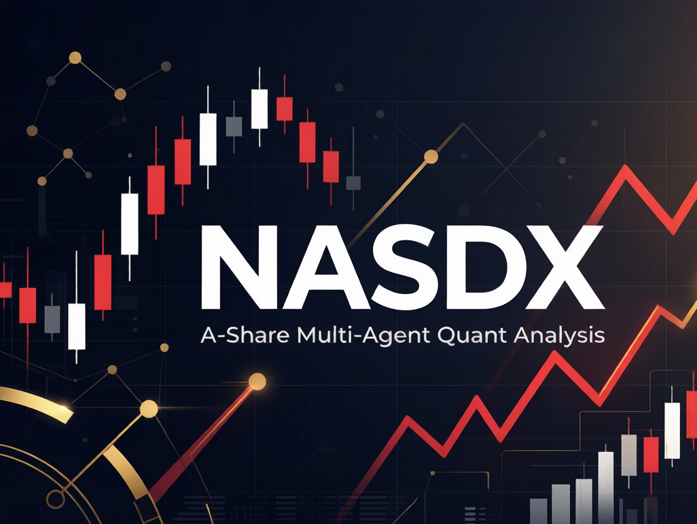

# NASDX — A 股多智能体量化分析系统

> 基于 [FinGenius](https://github.com/HuaYaoAI/FinGenius) 架构构建，无需付费行情 API，使用 AkShare / 腾讯行情免费数据源，支持任意 OpenAI 兼容接口。

[](https://www.python.org/)
[](https://streamlit.io/)
[](LICENSE)
[](https://github.com/akfamily/akshare)

---

## 目录

- [它能做什么](#它能做什么)
- [快速开始](#快速开始)
- [工作原理](#工作原理)
- [配置 LLM](#配置-llm)
- [进阶](#进阶)
- [监控池](#监控池)
- [免责声明与许可](#免责声明与许可)

---

## 它能做什么

按主题分组的核心能力，无需 API Key 也能跑通大部分分析：

| 主题 | 能力 |
|---|---|
| **行情扫描** | ETF50 全量技术面评分、60 只热门个股扫描（均线 / MACD / RSI / 布林带综合评分）、沪深北全 A 覆盖 |
| **多智能体分析** | 5 个专家 Agent（技术面 / 资金流 / 风险 / 板块 / 供应链瓶颈）+ 多空 Battle 辩论 + 综合研判 |
| **投研闭环** | 一键串联行情刷新 → ETF / 个股扫描 → 深度分析 → 组合路线 → 投资简报 |
| **决策与风控** | 保守 / 均衡 / 进取三档仓位纪律、数据质量闸门、候选证据核查、建议漂移追踪与结果复盘 |
| **桌面化** | Windows 桌面控制面板、便携包、安装器，复用现有 Streamlit UI |
| **历史与复盘** | SQLite 历史库、真实账户复盘（成交 CSV）、复盘快照包、盘前 / 盘中 / 盘后执行队列 |

> 无 API Key 时自动生成同结构的规则深度报告，仍进入组合路线与最终简报；有 Key 时升级为 LLM 结构化分析。

---

## 快速开始

### 1. 安装依赖

```bash
pip install -r requirements_nasdx.txt
```

Windows PowerShell 推荐独立虚拟环境：

```powershell
py -3.11 -m venv .venv
.\.venv\Scripts\Activate.ps1
python -m pip install -U pip
python -m pip install -r requirements_nasdx.txt
```

### 2. 启动界面

两种方式，任选其一：

```bash
# 方式 A：一键启动（双击 启动网页.bat 亦可）
streamlit run app.py

# 方式 B：Windows 桌面控制面板
python -B desktop\control_panel.py
```

### 3. 最常用的命令

| 命令 | 作用 |
|---|---|
| `python fetch_stock_data.py` | 抓取行情（无需 API Key） |
| `python scan_etf50.py` | ETF50 技术面扫描（秒出） |
| `python scan_stocks_full.py` | 60 只热门个股扫描 |
| `python run_analysis.py 603501` | 单股多智能体深度分析 |
| `python run_investment_workflow.py 603501` | 一键投研闭环 |
| `python run_portfolio_plan.py` | 生成组合级投资路线 |
| `python run_investment_brief.py` | 生成最终投资简报 |

<details>
<summary><b>展开：完整命令参考</b></summary>

**数据与分析**

```bash
# 获取数据（无需 API Key）
python fetch_stock_data.py

# ETF50 定时扫描与云端同步
python scan_and_sync.py
python scan_and_sync.py --no-sync

# 动态选股（网页默认预筛 50 只进入历史因子）
python run_stock_selector.py --limit 50

# 单股深度分析（auto / rules / llm 三种模式）
python run_analysis.py 603501 --risk-profile balanced
python run_analysis.py 603501 --mode rules --risk-profile balanced
python run_analysis.py 603501 --mode llm  --risk-profile balanced

# 一键投研闭环（analysis-only / quick / full / selector）
python run_investment_workflow.py 603501
python run_investment_workflow.py 603501 --workflow quick  --risk-profile balanced
python run_investment_workflow.py 603501 --workflow full  --rounds 1 --risk-profile conservative
python run_investment_workflow.py --workflow selector --analysis-mode rules

# 组合路线与简报
python run_portfolio_plan.py --risk-profile balanced
python run_investment_brief.py --risk-profile balanced

# 资金仓位换算（不写入账户数据）
python run_position_sizing.py --capital 100000 --current-etf 10000 --current-stock 5000 --risk-profile balanced

# 建议漂移追踪 / 结果复盘
python run_recommendation_tracker.py --print
python run_recommendation_review.py --print

# 真实账户复盘（从成交 CSV 计算盈亏）
python run_account_review.py --ledger trades.csv --capital 100000 --print

# 导出复盘快照包
python run_review_snapshot.py --risk-profile balanced

# 建议样本外评价：冻结决策记录（只读查看，写入由生成流程完成）
python -m nasdx.decision_record status
python -m nasdx.decision_record list --code 600519 --limit 20
```

**三类"复盘"不是一回事**

这三条链路回答完全不同的问题，指标不可互相替代，也不能混在一张表里比较：

| 链路 | 回答的问题 | 入口 | 数据来源 | 典型指标 |
|---|---|---|---|---|
| 信号延续复盘 | 当初那个**信号今天还成立吗** | `run_recommendation_tracker.py` / `run_recommendation_review.py` | 当前行情重算信号 | 信号是否漂移、是否触发复核 |
| 真实账户复盘 | 我的**账户实际赚了多少** | `run_account_review.py --ledger trades.csv` | 用户成交 CSV | 已实现 / 未实现盈亏、持仓成本 |
| 建议样本外评价 | 当时那条**建议本身好不好** | `nasdx.decision_record` + `nasdx.outcome_labels` + `nasdx.decision_evaluation` | 生成时冻结的记录 + 之后的 K 线 | T+1/3/5/10/20 收益、MFE / MAE、胜率、CI95、置信度校准 |

第三条链路的关键约束：

- 决策在生成瞬间冻结（参考价、`data_as_of`、周期、配置版本）；记录表 **insert-only**，同 id 内容变化直接拒绝，结果标签写在独立表。
- 前瞻标签只读取 `data_as_of` **之后**的 K 线，交易日以真实 K 线为准（跳过周末与停牌），杜绝前视偏差。
- `rules` / `full` / `intraday` 及消融变体写同一套 schema，可直接做模式对比与边际贡献分析。
- 首日停牌 / 一字涨停标记为不可成交，默认从统计中剔除并计入剔除原因。
- 类别语义不同：`buy` / `hold` 涨为好，`reduce` / `avoid` 跌为好，不能合并计算胜率。
- 所有 `*_pct` 一律是百分比（`5.0` 表示 5%）。样本量不足时先报样本量，不下结论。

环境变量：`NASDX_DECISION_DB`（覆盖库路径）、`NASDX_DECISION_RECORDS=0`（关闭落库）、`NASDX_DECISION_RECORDS_MAX`（保留上限，默认 5000）。

**自检与发布门禁**

```bash
python run_final_audit.py          # 最终版交付自检
python run_product_readiness.py    # 产品化巡检聚合（单测 + 最终审计）
```

`run_final_audit.py` 必须**退出码为 0** 才算交付自检通过；任何非 0 退出（含 README / 决策文档缺失）都视为发布门禁未过，不可标注为「验证通过」。CI 的 Final Audit Gate 会在 `master` / PR 上运行该脚本，非 0 退出即判失败（详见 `.github/workflows/final-audit.yml`）。

| 工作流 | 做什么 | 适合场景 |
|---|---|---|
| `analysis-only` | 用最新本地行情做 5 Agent 深度分析 | 已有新数据，只看行动计划 |
| `quick` | 刷新行情 + ETF50 扫描 + 深度分析 | 先看大盘 / ETF 强弱，再看单票 |
| `full` | 刷新行情 + ETF50 / 个股双扫描 + 深度分析 | 完整复盘或盘后筛选 |

</details>

---

## 工作原理

分析分三个阶段，最终输出 HTML / JSON 报告：

```
用户输入股票代码
        ↓
  ┌─────────────────────────────────┐
  │  Phase 1 · Research 研究阶段     │
  │   技术面 → 资金流 → 风险 → 板块  │
  │   → 供应链瓶颈（5 Agent 并发）   │
  ├─────────────────────────────────┤
  │  Phase 2 · Battle 辩论阶段       │
  │   多头辩手 ⇄ 空头辩手            │
  │   裁判综合 → 5 位投票者           │
  ├─────────────────────────────────┤
  │  Phase 3 · Synthesis 综合研判    │
  │   行动计划 + 仓位纪律 + 风险复核  │
  └─────────────────────────────────┘
        ↓
  HTML / JSON 报告
```

- **研究阶段** 默认用 `ThreadPoolExecutor` 并发跑 5 个 Agent；调试或限流时设 `NASDX_RESEARCH_MAX_WORKERS=1` 退回顺序执行。
- **LLM 结构化输出**：Agent 返回 `signal` / `confidence` / `conclusion` / `key_points` 字段，未返回合法 JSON 时回退到文本解析。
- **增量分析**（#65）：支持 `full` / `intraday` / `refresh` 三档深度，盘中重复刷新只跑失效维度，详见[进阶](#进阶)。

---

## 配置 LLM

支持任意 OpenAI 兼容接口，API Key 只通过环境变量或网页会话输入，不写入 Git 跟踪文件：

| 服务 | base_url | 推荐模型 |
|---|---|---|
| DeepSeek（推荐） | `https://api.deepseek.com` | `deepseek-chat` |
| 阿里通义 | `https://dashscope.aliyuncs.com/compatible-mode/v1` | `qwen-turbo` |
| Moonshot | `https://api.moonshot.cn/v1` | `moonshot-v1-8k` |
| Ollama 本地 | `http://localhost:11434/v1` | `qwen2.5:14b` |

```powershell
$env:NASDX_API_KEY="sk-xxxx"
$env:NASDX_BASE_URL="https://api.deepseek.com"
$env:NASDX_MODEL="deepseek-chat"
```

**Windows 桌面配置** 见 [`docs/WINDOWS_DESKTOP.md`](docs/WINDOWS_DESKTOP.md)；桌面启动器也支持 `%APPDATA%\NASDX\config.toml` 本地用户配置。

---

## 进阶

<details>
<summary><b>开发、测试与安全检查</b></summary>

开发 / 测试工具单独安装，避免混入普通运行环境：

```powershell
python -m pip install -r requirements-dev.txt
python -m pytest
python -m ruff check --no-cache .
python -B -m unittest discover -s tests
python -B run_security_checks.py --skip-optional
python -B run_desktop_doctor.py
python -B run_desktop_release_check.py
```

可选安装本地提交前检查：

```powershell
pre-commit install
pre-commit run --all-files
```

轻量安全检查默认只扫描可入库文本文件里的疑似密钥；加 `--history` 可扫描所有 ref 可达的历史 blob（覆盖"提交后又删掉"）；若已安装 `pip-audit` / `bandit` / `detect-secrets`，可显式运行 `python -B run_security_checks.py --run-optional`。

CI 侧的安全门禁：`security.yml`（自研多供应商扫描 + 固定版本 gitleaks，当前树与全历史）、`codeql.yml`（Python SAST，PR / push / 每周定时）、`dependabot.yml`（依赖与 Actions 升级 PR）。所有 workflow 显式声明最小权限，官方 Action 全部固定到 commit SHA。

**漏洞报告与密钥泄露响应流程** 见 [`SECURITY.md`](SECURITY.md)——请勿用公开 Issue 报告未公开漏洞。

**子代理协作** 见 [`docs/SUBAGENT_WORKFLOW.md`](docs/SUBAGENT_WORKFLOW.md)。

</details>

<details>
<summary><b>Windows 桌面打包</b></summary>

桌面入口复用现有 Streamlit UI，提供控制面板、便携包与安装器。完整命令（便携包构建、zip、installer 编译、smoke 验证、release gate）见 [`docs/WINDOWS_DESKTOP.md`](docs/WINDOWS_DESKTOP.md)。

常用入口：

```powershell
python -B desktop\control_panel.py                 # 桌面控制面板
.\启动NASDX桌面.bat --dry-run --page plan           # 验证批处理入口
python -B desktop\launcher.py --page plan           # 打开投资路线页
python -B run_desktop_release_check.py --write-evidence   # 桌面发布前聚合检查
```

原生桌面窗口体验（可选 WebView2 / pywebview）：

```powershell
python -m pip install -r requirements_desktop.txt
python -B desktop\launcher.py --webview --page plan
```

</details>

<details>
<summary><b>分析缓存契约（#65）</b></summary>

深度分析支持 `full` / `intraday` / `refresh` 三档深度，通过 `NasdxAnalyzer(depth=...)` 控制，`run_analysis.py` 也接受 `--depth`：

| 深度 | 行为 | 何时用 |
|---|---|---|
| `full` | Research → Battle → Synthesis 完整跑 | 首次分析、行情大变、模型 / 提示升级后 |
| `intraday` | 只刷新失效的行情类维度，复用慢变量结论 | 盘中同一标的的重复刷新 |
| `refresh` | 只重跑被失效规则命中的维度 | 只想确认某几个维度是否变化 |

缓存契约（用户数据目录，绝不入库、不进发布产物）：

- **硬身份键**（文件名）：`stock_code` / `provider` / `model` / `prompt_version` / `agent_config_version` / `cache_schema_version`。任一变化 → 不同快照文件。
- **软失效输入**（逐维度）：`price_fingerprint` / `sector_fingerprint` / `fundamental_fingerprint` / `risk_profile` / `portfolio_snapshot_hash` / `trading_day`。仅让真正依赖它的维度失效。
- **逐维度 TTL**：`technical` / `fund_flow` 300s、`risk` 900s、`sector` 1800s、`chokepoint` 14400s，可用 `NASDX_ANALYSIS_TTL_<DIMENSION>` 覆盖。
- **绝不静默复用**：缺失 / 损坏 / 版本不符一律按 miss 处理；报告 `freshness` 逐维度标注「本次刷新 `refreshed`」还是「复用上一轮 `reused`」。

</details>

<details>
<summary><b>组合路线与决策框架</b></summary>

组合路线包含：仓位框架（总仓位上限 / ETF 预算 / 个股预算 / 现金缓冲）、候选分层（ETF 主线 / 个股卫星 / 观察名单 / 回避池）、未来情景推演、执行规则、深度报告与规则深度报告、扫描覆盖率闸门、最终简报、候选证据核查、资金仓位换算、建议漂移追踪、建议结果复盘、真实账户复盘、执行队列、外部复核包、复盘快照包、SQLite 历史库（nasdx_history.db）。

每条组合级投资路线在选定的 **风险画像**（保守 / 均衡 / 进取）下生成；单票决策与资金仓位换算同样以此三档纪律为基准，组合路线与单票分析共用同一套 风险画像 约束。

**真实账户复盘** 读取成交 CSV 形式的 **账户流水**，计算已实现 / 未实现盈亏与持仓成本，与「建议结果复盘」两条链路数据来源互不替代（详见下方「三类复盘不是一回事」）。

每次分析或扫描运行都带一个 **task_id**（出现在日志文件名 `nasdx_log_{code}_{task_id}.txt` 与 ETF50 扫描标识 `etf50_scan_task_id` 中），用于跨运行追溯同一标的的多次决策。简报、单股报告、扫描与 ETF 池结果统一写入 SQLite 历史库 **nasdx_history.db**，支撑历史回看与复盘快照包。

完整决策框架与契约见 [`docs/INVESTMENT_DECISION_FRAMEWORK.md`](docs/INVESTMENT_DECISION_FRAMEWORK.md)。

</details>

---

## 监控池

**股票（6 板块 × 5 只）**

| 板块 | 代表标的 |
|---|---|
| 半导体 | 中芯国际、韦尔股份、兆易创新、华虹半导体、北京君正 |
| 半导体设备 | 北方华创、中微公司、华海清科、芯源微、盛美上海 |
| 通信 | 中兴通讯、中际旭创、烽火通信、华工科技、新易盛 |
| 电力 | 长江电力、国电南瑞、三峡能源、中国核电、特变电工 |
| AI 算力 | 寒武纪、海光信息、科大讯飞、中科曙光、海康威视 |
| 军工 | 中航西飞、航发动力、中航光电、紫光国微、振华科技 |

**ETF 池（50 只）** 涵盖半导体芯片、科创板、通信 5G、电力电网、AI 算力、军工、海外纳指、港股科技、红利低波、机器人等主题。

---

## 免责声明与许可

本项目仅供学习研究，所有分析结果为技术规则计算或 AI 推演，**不构成任何投资建议**。股市有风险，投资需谨慎。

MIT License — 自由使用，欢迎 Star ⭐ 和 PR。

---

基于 [FinGenius](https://github.com/HuaYaoAI/FinGenius) 开源架构 · 数据来自 [AkShare](https://github.com/akfamily/akshare)  
供应链瓶颈研究维度参考 Serenity Chokepoint Investing Skill（仅作研究框架，不作投资建议）。
